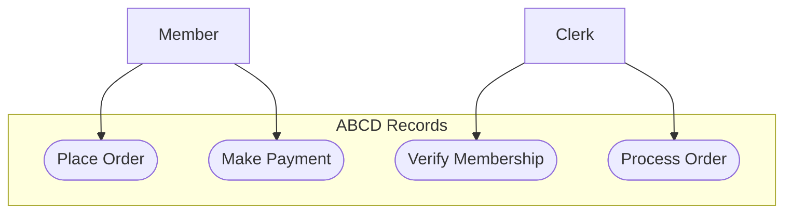
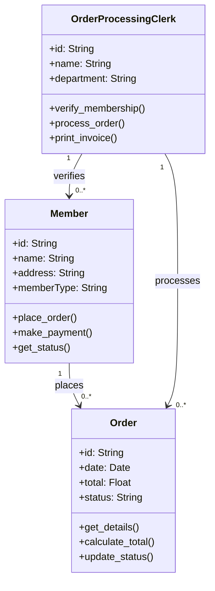
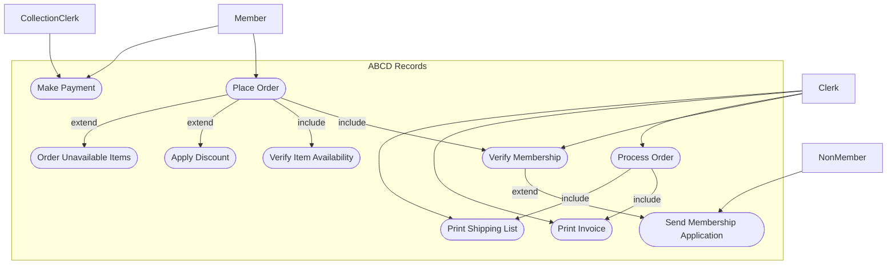
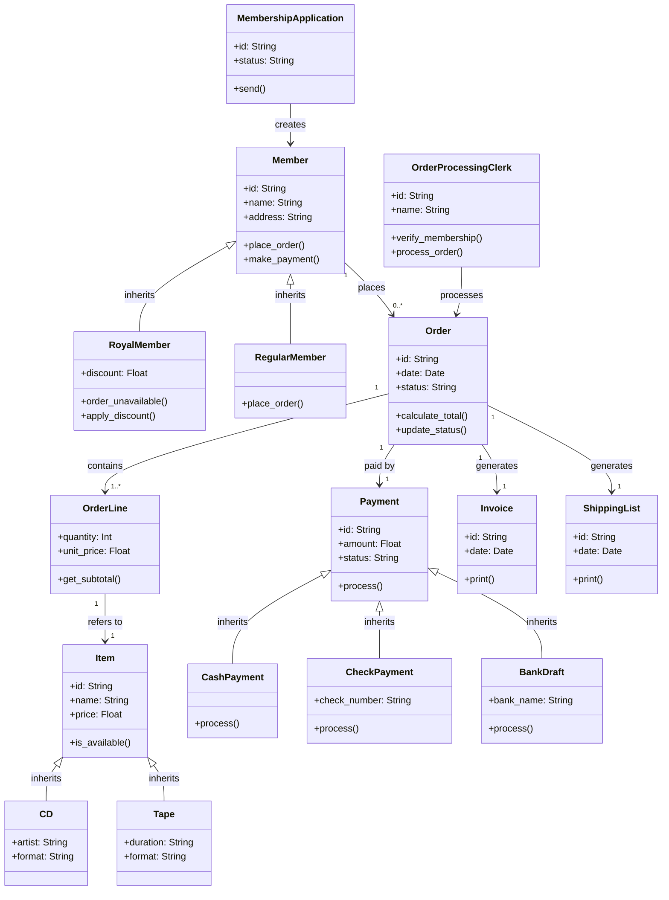
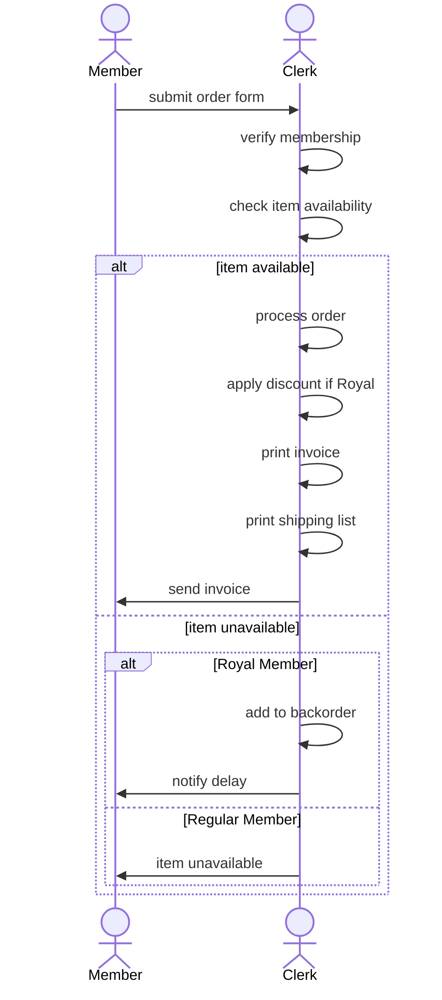
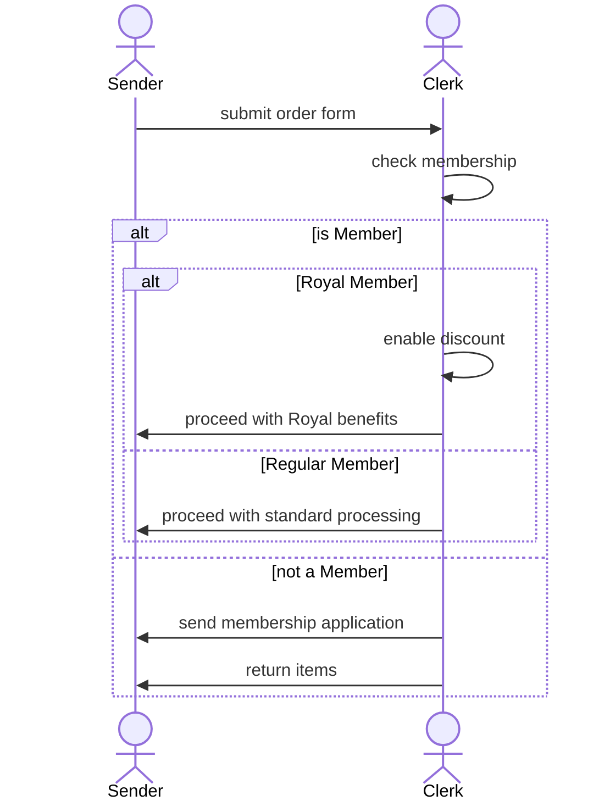
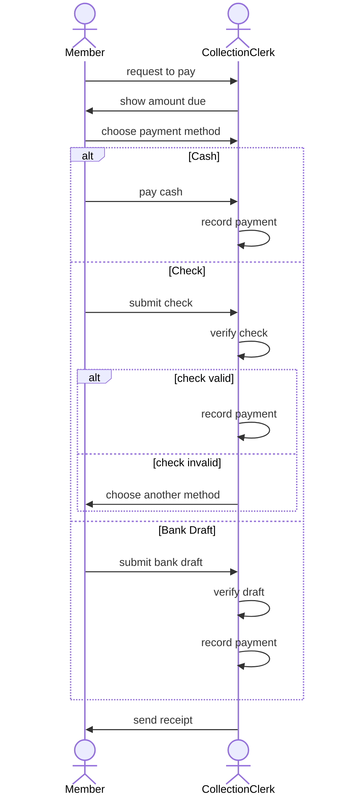
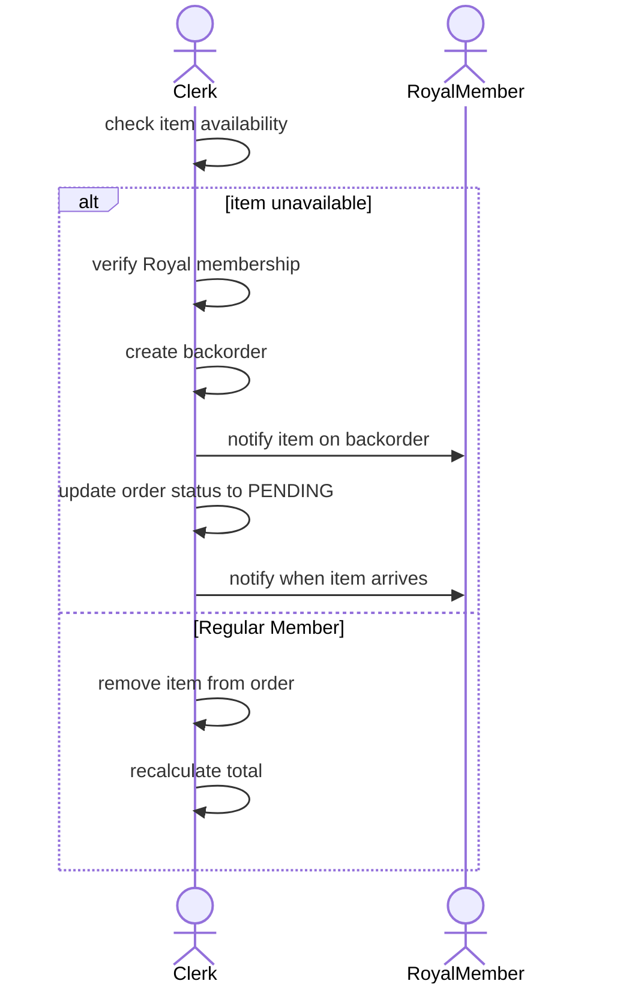

# Exercice 2 - ABCD Records

## Level 1  

### Task 1.1: Basic Use Case Diagram

### Task 1.2: Basic Class Diagram

## Level 2 

### Complete Use Case Diagram

### Complete Class Diagram

## Level 3 

### Sequence Diagram 1: Complete Order Processing Flow

### Sequence Diagram 2: Membership Verification

### Sequence Diagram 3: Payment Processing

### Sequence Diagram 4: Item Reordering for Royal Members
